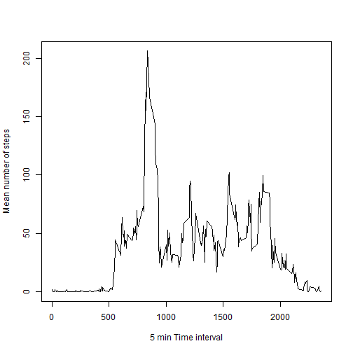

## Initial data load


```r
orData <- read.csv("activity.csv")
```

## Mean total number of steps taken per day
The NA values are removed from the calculation

Histogram of total number of steps taken each day


```r
stepsbyDay <- aggregate(orData$steps~orData$date,orData, FUN=sum,na.rm=TRUE)
names(stepsbyDay)<- c("date","steps")

hist(stepsbyDay$steps, xlab = "Steps by day", main = "Histogram of Steps by day")
```

 

Calculation of total, mean and median steps by day


```r
totalSteps <- sum(orData$steps, na.rm = TRUE)
meanSteps <- mean(orData$steps, na.rm = TRUE)
medianSteps <- median(orData$steps, na.rm = TRUE)
```

Mean total number of steps by day: 37.3825996

Median of total number of steps by day: 0

## Average daily activity pattern


```r
intervalMean <- aggregate(orData$steps~orData$interval,orData, FUN= mean, na.rm=TRUE)
names(intervalMean) <- c("interval","steps")

plot(x=intervalMean$interval, y=intervalMean$steps, type = "l", xlab= "5 min Time interval", ylab = "Mean number of steps")
```

 

```r
maxSteps <- max(intervalMean$steps)
maxInterval <- intervalMean$interval[intervalMean$steps == maxSteps]
```

The 5 minute interval that contains the maximum number of steps across all days is: 835

# Inputting missing values

Calculation of number of rows with missing values:


```r
countNA <- sum(is.na(orData$steps))
```

The number of rows with missing values for steps is: 2304


Fill the missing data with the mean value for the interval

First the new dataset is created


```r
rowsNA <- which(is.na(orData$steps))
inervalsNA <- orData$interval[is.na(orData$steps)]

filedData <- orData
for (i in rowsNA){
        intervalNA <-  filedData$interval[i]
        intervalValue <- intervalMean$steps[intervalMean$interval==intervalNA]
      filedData$steps[i]<- intervalValue  
}
```

Histogram of total number of steps taken each day for the new dataset


```r
stepsbyDay2 <- aggregate(filedData$steps~filedData$date,filedData, FUN=sum)
names(stepsbyDay2)<- c("date","steps")
hist(stepsbyDay2$steps, xlab = "Steps by day", main = "Histogram of Steps by day")
```

 

Calculation of total, mean and median steps by day for the new dataset


```r
totalSteps2 <- sum(filedData$steps)
meanSteps2 <- mean(filedData$steps)
medianSteps2 <- median(filedData$steps)
```

Mean total number of steps by day for the new dataset: 37.3825996

Median of total number of steps by day for the new dataset: 0

## Difference in patterns between weekdays and weekends

Create a new factor column


```r
weekdays <- as.Date(filedData$date)

filedData$weekday <- ifelse(weekdays(as.Date(filedData$date))=="sabado"|weekdays(as.Date(filedData$date))=="domingo","weekend","weekday")
```

Separate weekdays and weekend data and plot results


```r
intervalWDMean <- aggregate(list(steps=filedData$steps),by = list(interval=filedData$interval,wd = filedData$weekday), FUN= mean)

weekdays <- intervalWDMean[which(intervalWDMean$wd=="weekday"),]
weekends <- intervalWDMean[which(intervalWDMean$wd=="weekend"),]

par(mfrow=c(2,1))

plot(x=weekdays$interval, y=weekdays$steps, type = "l", xlab = "5 min time interval", ylab = "Steps",main="Weekday")
plot(x=weekends$interval, y=weekends$steps, type = "l", xlab = "5 min time interval", ylab = "Steps", main="Weekend")
```

 


